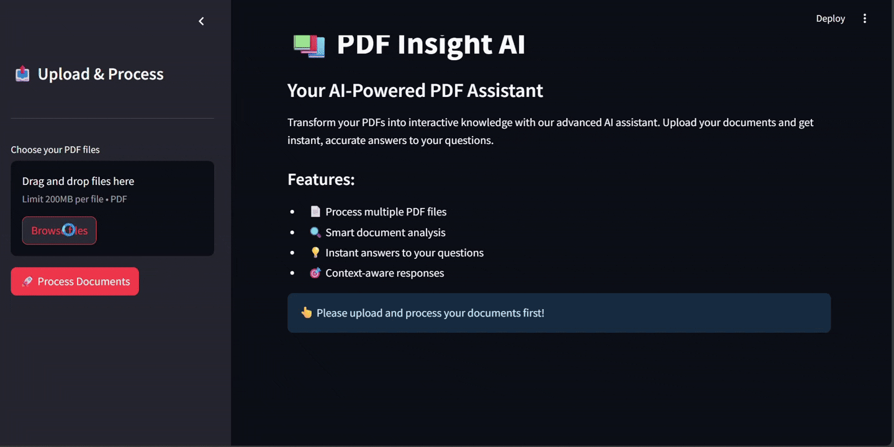

# PDF Insight AI

An intelligent PDF document analyzer powered by Google's Gemini AI. This application allows users to upload PDF documents and get instant, accurate answers to their questions about the content.

## Demo



## Features

- 📄 Process multiple PDF files simultaneously
- 🔍 Smart document analysis using RAG (Retrieval-Augmented Generation)
- 💡 Instant answers to your questions
- 🎯 Context-aware responses
- 🔒 Secure document processing

## Prerequisites

- Python 3.8 or higher
- Google API key (Gemini)

## Installation

1. Clone the repository:
```bash
git clone https://github.com/yourusername/pdf-insight-ai.git
cd pdf-insight-ai
```

2. Install dependencies:
```bash
pip install -r requirements.txt
```

3. Create a `.env` file in the root directory and add your Google API key:
```
GOOGLE_API_KEY=your_google_api_key_here
```

## Usage

1. Start the application:
```bash
streamlit run src/app.py
```

2. Open your browser and navigate to `http://localhost:8501`

3. Upload your PDF documents using the sidebar

4. Click "Process Documents" to analyze the content

5. Ask questions about your documents in the chat interface

## Project Structure

```
pdf-insight-ai/
├── src/
│   ├── utils/
│   │   ├── __init__.py
│   │   ├── pdf_processor.py
│   │   └── ai_model.py
│   └── app.py
├── data/
│   └── vector_store/
├── video/
│   └── insightpdf_video.mp4
├── .env
├── .gitignore
├── requirements.txt
└── README.md
```

## Security

- API keys are stored in environment variables
- PDF processing is done locally
- No data is stored permanently

## Contributing

Contributions are welcome! Please feel free to submit a Pull Request.

## License

This project is licensed under the MIT License - see the LICENSE file for details. 